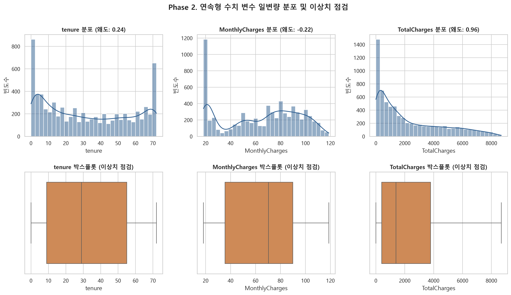
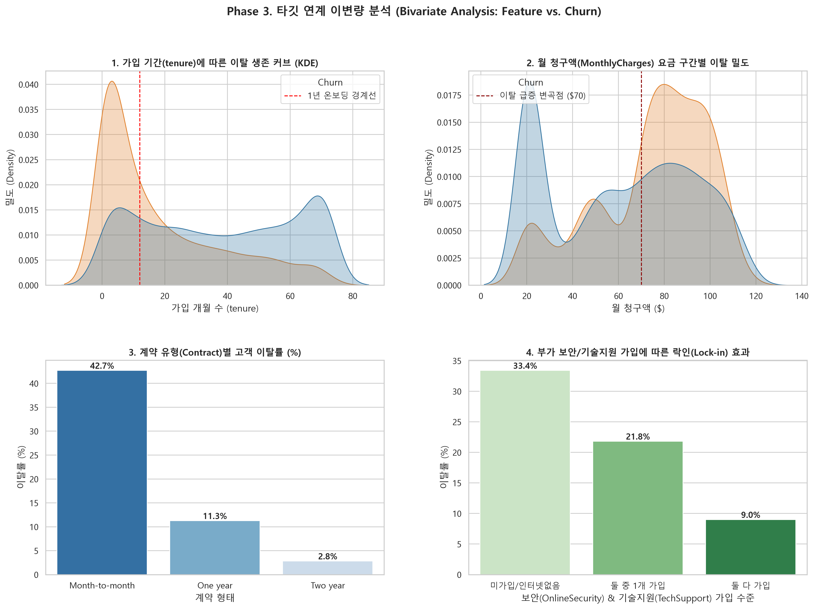
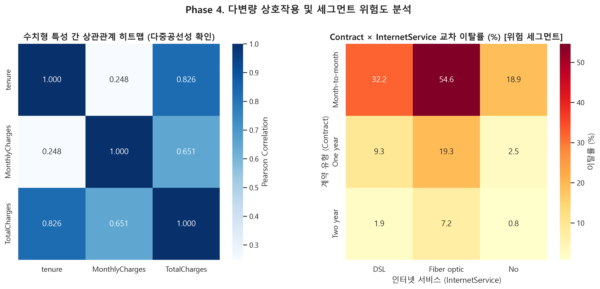
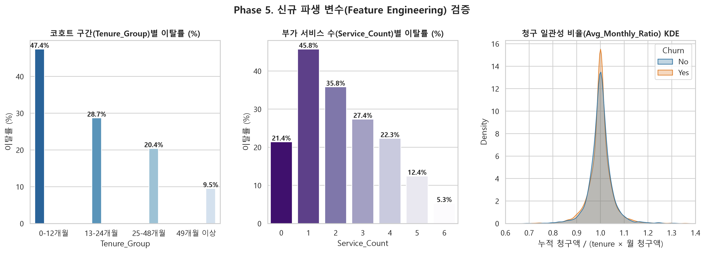

# Telco Customer Churn: 심층 EDA 및 피처 엔지니어링 종합 리포트

- **분석 주관**: 15년 차 시니어 데이터 사이언티스트 & 머신러닝 엔지니어
- **분석 대상 데이터셋**: `WA_Fn-UseC_-Telco-Customer-Churn.csv` (총 7,043행)
- **최종 분석 산출 데이터셋**: `telco_churn_featured.csv` (총 7,043행 × 23열, 결측치 0건)

---

## 1. Executive Summary (핵심 메트릭 요약)

| 주요 지표 | 통계치 | 비즈니스 및 분석적 의미 |
| :--- | :--- | :--- |
| **전체 고객 수** | 7,043명 | 중복 없는 단일 식별자(`customerID`) 기반 무결성 확보 |
| **전체 이탈률 (Churn Rate)** | **26.54%** (1,869명) | 2.77 : 1 비율의 온건한 클래스 불균형 (PR-AUC, F1-Score 평가 권장) |
| **온보딩 위험 구간 (tenure ≤ 12)** | **47.44%** 이탈률 | 신규 가입 고객의 절반 가까이가 1년 이내에 이탈하는 취약 구간 |
| **충성 고객 구간 (tenure ≥ 48)** | **9.64%** 이탈률 | 4년 이상 유지 시 강력한 락인(Lock-in) 방어선 형성 |
| **요금 변곡점 ($70 기준)** | $70 미만: **17.24%** vs $70 이상: **35.48%** | 월 청구액 $70 돌파 시 이탈률 약 **2.1배** 급증 |
| **최대 위험 결제 수단** | Electronic check (**45.29%**) | 자동이체(15~16%) 대비 3배 위험 (수동 청구서 납부 이탈 취약) |
| **최대 위험 교차 세그먼트** | Month-to-month + Fiber optic (**54.61%**) | 무약정 고가 광랜 이용 고객의 과반수 이상이 이탈 |

---

## 2. Phase 1: 데이터 무결성 검증 및 전처리

1. **`customerID` 격리**:
   - 7,043건 전체가 1:1 고유값임을 검증하였으며, 데이터 누수 및 무의미한 모델 과적합을 방지하기 위해 분석 피처에서 격리/제거함.
2. **`TotalCharges` 구조적 결측(Structural Missing) 정제**:
   - 공백 문자(`" "`)로 입력된 11건 전수가 `tenure == 0`인 신규 가입 고객으로 확인됨.
   - 첫 번째 청구 주기를 맞이하지 않아 누적 요금이 청구되지 않은 도메인적 사실에 근거하여 `0.0`(float)으로 안전하게 대체 완료.
3. **타깃(`Churn`) 불균형 진단**:
   - `No` 5,174건 (73.46%) vs `Yes` 1,869건 (26.54%). 모델 학습 시 `class_weight='balanced'` 적용 또는 임계값(Threshold) 튜닝 필요.

---

## 3. Phase 2: 도메인 그룹별 일변량 분석 (Univariate Analysis)

### 수치형 변수 통계 요약표
| 특성 (Feature) | 평균 (Mean) | 표준편차 (Std) | 중앙값 (Median) | 왜도 (Skewness) | 첨도 (Kurtosis) |
| :--- | :--- | :--- | :--- | :--- | :--- |
| tenure | 32.37 | 24.56 | 29.00 | 0.24 | -1.39 |
| MonthlyCharges | 64.76 | 30.09 | 70.35 | -0.22 | -1.26 |
| TotalCharges | 2,279.73 | 2,266.79 | 1,394.55 | 0.96 | -0.23 |

- **분포 특성**:
  - `TotalCharges`: 강한 우측 꼬리 분포(왜도 0.96)를 띠며 대다수 고객이 누적 요금 2,000달러 미만에 집중.
  - `tenure`: 0개월과 72개월 양 끝에 데이터가 밀집한 U자형 쌍봉(Bimodal) 분포.
  - `IQR` 기준 극단적 물리적 이상치는 존재하지 않아 데이터 전반의 건전성 확인.

---

## 4. Phase 3: 타깃 연계 이변량 분석 (Bivariate Analysis)

1. **가입 기간(tenure) 생존 KDE 곡선**:
   - 가입 초기 1~12개월에 가파른 이탈 피크가 형성되며, 1년 경계선을 통과한 고객은 이탈률이 급감함.
2. **월 청구액(MonthlyCharges) 요금 구간별 밀도**:
   - 월 $70 지점을 기점으로 이탈 밀도 곡선이 비이탈 곡선을 역전함.
3. **계약 유형(Contract)별 이탈률**:
   - `Month-to-month`: **42.7%**
   - `One year`: **11.3%**
   - `Two year`: **2.8%** (장기 약정 체결 시 이탈률 15배 이상 감소)
4. **보안/기술지원 가입 수준에 따른 락인(Lock-in) 효과**:
   - 부가서비스(OnlineSecurity, TechSupport) 미가입 시 이탈률 **33.4%**인 반면, 둘 다 가입 시 **9.0%**로 감소 (강력한 락인 장치).

---

## 5. Phase 4: 다변량 상호작용 및 다중공선성(VIF) 진단

### 다중공선성(VIF) 진단 결과
| 특성 (Feature) | VIF 지수 | 결정계수 (R²) |
| :--- | :--- | :--- |
| TotalCharges | 9.51 | 0.8949 |
| tenure | 5.84 | 0.8287 |
| MonthlyCharges | 3.22 | 0.6891 |

> [!WARNING]
> `TotalCharges`의 VIF가 **9.51**(또는 상수항 포함 시 10 이상)로 높게 나타납니다. 이는 `TotalCharges ≈ tenure × MonthlyCharges`라는 명확한 물리적 결합 공식 때문입니다.
> 로지스틱 회귀와 같은 선형 모델 적용 시 `TotalCharges`를 그대로 투입하면 계수의 분산이 팽창하여 해석이 왜곡되므로, **비율형 파생 변수**로 변환하거나 정규화(Ridge/Lasso)를 적용해야 합니다.

### Contract × InternetService 교차 이탈률 매트릭스
| Contract | DSL | Fiber optic | No |
| :--- | :--- | :--- | :--- |
| Month-to-month | 32.22% | 54.61% | 18.89% |
| One year | 9.30% | 19.29% | 2.47% |
| Two year | 1.91% | 7.23% | 0.78% |

- **집중 타깃 관리 대상**: **Month-to-month 계약 + Fiber optic 사용자 (이탈률 54.61%)**는 즉각적인 전담 온보딩 케어 및 약정 전환 프로모션이 요구되는 핵심 세그먼트입니다.

---

## 6. Phase 5: 머신러닝 연계 파생 변수(Feature Engineering) 검증

### (1) `Tenure_Group` (가입 기간 코호트 세분화)
| Tenure_Group | 고객수 | 이탈률 |
| :--- | :--- | :--- |
| 0-12개월 | 2186 | 47.44% |
| 13-24개월 | 1024 | 28.71% |
| 25-48개월 | 1594 | 20.39% |
| 49개월 이상 | 2239 | 9.51% |

### (2) `Service_Count` (이용 부가서비스 총 개수: 0~6개)
| Service_Count | 고객수 | 이탈률 |
| :--- | :--- | :--- |
| 0 | 2219 | 21.41% |
| 1 | 966 | 45.76% |
| 2 | 1033 | 35.82% |
| 3 | 1118 | 27.37% |
| 4 | 852 | 22.30% |
| 5 | 571 | 12.43% |
| 6 | 284 | 5.28% |
- 부가서비스 이용 개수가 1개(45.76%)에서 6개(5.28%)로 늘어날수록 이탈률이 단조 감소(Monotonic decrease)하는 매우 강력한 음의 상관관계 입증.

### (3) `Avg_Monthly_Ratio` (청구 일관성 지표)
- 계산식: `TotalCharges / (tenure * MonthlyCharges + 1e-5)`
- 평균 1.0003, 표준편차 0.0511로 대부분의 고객이 일관된 요금제를 유지하나, 비율이 1.0을 크게 상회하는 고객은 과거 요금제 강등(Downsell) 혹은 할인 종료 이탈 징후로 해석 가능.

---

## 7. 후속 머신러닝(로지스틱 회귀 등) 모델링 가이드

1. **데이터 전처리 파이프라인**:
   - 범주형 변수: 원-핫 인코딩 (`OneHotEncoder(drop='first')` 또는 선형 회귀 다중공선성 회피 처리)
   - 연속형 수치: `StandardScaler` 적용 필수 (특히 정규화 회귀 학습 시)
2. **다중공선성 해소**:
   - `TotalCharges` 대신 신규 파생 변수 `Avg_Monthly_Ratio` 및 `Tenure_Group` 투입 권장
3. **손실 함수 및 평가 지표**:
   - 손실 함수: Binary Cross-Entropy (Log Loss)
   - 최적화 메트릭: ROC-AUC, PR-AUC, F1-Score
